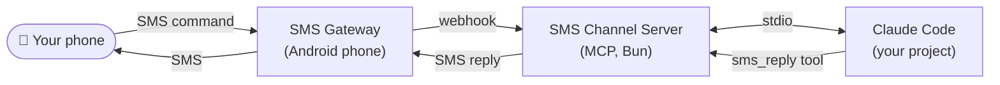

# sms-to-claude

A [Claude Code Channel](https://code.claude.com/docs/en/channels-reference) that lets you control a Claude Code session via SMS. Send natural language commands, get replies, and approve/deny tool use — all over text message.



## How it works

- **Send a command** — SMS your number, Claude receives it via the Android gateway and gets to work
- **Get a reply** — Claude uses the `sms_reply` tool to SMS you when done
- **Permission relay** — when Claude needs to run a tool requiring approval, you get an SMS like:

  ```
  [Permission needed]
  Tool: Bash
  rm -rf dist/

  Reply: yes abcde OR no abcde
  ```

  Reply `yes abcde` or `no abcde` to approve or deny.

## Requirements

- [Bun](https://bun.sh) installed
- Claude Code v2.1.81+ with a claude.ai login (not API key auth)
- An Android phone (any cheap/old one) with the [SMS Gateway for Android](https://github.com/capcom6/android-sms-gateway) app installed
- Both the Android phone and your Mac on the same local network

## Setup

**1. Install dependencies**

```bash
bun install
```

**2. Configure environment**

```bash
cp .env.example .env
```

Edit `.env`:

```
GATEWAY_BASE_URL=http://192.168.1.5:8080     # Android phone's local IP + port 8080
GATEWAY_LOGIN=your-gateway-login
GATEWAY_PASSWORD=your-gateway-password
WEBHOOK_URL=http://192.168.1.100:8081/webhook # This machine's local IP, any free port
WEBHOOK_PORT=8081                             # Port for the local webhook server (optional if in WEBHOOK_URL)
ALLOWED_PHONE_NUMBERS=+90xxxxxxxxx            # Your personal number (allowlist)
```

> **Finding your credentials:** Open the SMS Gateway app on the Android phone → tap the hamburger menu → Settings → API. Your login and password are shown there. The phone's local IP is shown on the Local Server screen.

**3. Register with Claude Code**

Copy `.mcp.json.example` to your project directory as `.mcp.json` and replace both `/absolute/path/to/sms-to-claude` placeholders with the real path to this repo:

```json
{
  "mcpServers": {
    "sms": {
      "command": "bun",
      "args": [
        "--env-file", "/Users/you/dev/sms-to-claude/.env",
        "/Users/you/dev/sms-to-claude/src/index.ts"
      ]
    }
  }
}
```

The `--env-file` flag tells Bun exactly where to find the credentials, regardless of which project directory Claude Code is running from.

**4. Start Claude Code**

From your project directory:

```bash
claude --dangerously-load-development-channels server:sms
```

The `--dangerously-load-development-channels` flag is required during the research preview. It bypasses the channel allowlist for the named MCP server entry.

## Usage

Once running, SMS your number from your allowlisted phone. Claude receives the message, works on your project, and replies via SMS when done.

**Tips:**
- Responses longer than 1600 characters are truncated with `[truncated]` — ask Claude to summarize if needed
- Send `yes <id>` or `no <id>` to respond to permission prompts
- If you send a new command while a permission prompt is pending, Claude will start on the new command concurrently — sequence your messages deliberately

## Security

Only phone numbers listed in `ALLOWED_PHONE_NUMBERS` can send commands to Claude. All other senders are silently dropped. Keep your `.env` file out of version control (it's gitignored).

## Project structure

```
src/
  config.ts           — env var loading and validation
  gateway.ts          — Android SMS Gateway client (send + webhook registration)
  webhook-receiver.ts — Inbound SMS webhook server, deduplication, allowlist, verdict detection
  permissions.ts      — permission relay state, timeout sweep
  index.ts            — MCP server, tool registration, wiring
tests/
  config.test.ts
  gateway.test.ts
  permissions.test.ts
```

## Running tests

```bash
bun test
```
