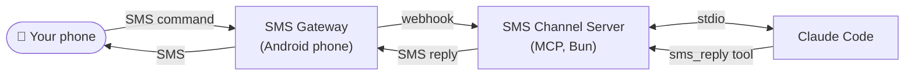

# sms-to-claude

A [Claude Code Channel](https://code.claude.com/docs/en/channels-reference) that lets you control a Claude Code session via SMS. Send natural language commands, get replies, and approve/deny tool use — all over text message.



## How it works

- **Send a command** — SMS your number, Claude receives it via the Android gateway and gets to work
- **Get a reply** — Claude uses the `sms_reply` tool to SMS you when done
- **Permission relay** — when Claude needs to run a tool requiring approval, you get an SMS like:

  ```
  [Permission needed]
  Tool: Bash
  rm -rf dist/

  Reply: yes x7k OR no x7k
  ```

  Reply `yes x7k` or `no x7k` to approve or deny. The short code is a unique ID for that request — it keeps your reply matched to the right prompt if multiple are queued.

## Requirements

- [Bun](https://bun.sh) installed
- Claude Code v2.1.81+ with a claude.ai login (not API key auth)
- An Android phone (any cheap/old one) with the [SMS Gateway for Android](https://github.com/capcom6/android-sms-gateway) app installed
- Both the Android phone and your Mac on the same local network

## Setup

**1. Install dependencies**

```bash
bun install
```

**2. Configure environment**

```bash
cp .env.example .env
```

Edit `.env`:

```
GATEWAY_BASE_URL=http://192.168.1.5:8080     # Android phone's local IP + port 8080
GATEWAY_LOGIN=your-gateway-login
GATEWAY_PASSWORD=your-gateway-password
WEBHOOK_URL=http://192.168.1.100:8081/webhook # This machine's local IP, any free port
WEBHOOK_PORT=8081                             # Port for the local webhook server (optional if in WEBHOOK_URL)
ALLOWED_PHONE_NUMBERS=+90xxxxxxxxx            # Your personal number (allowlist)
WEBHOOK_SIGNING_KEY=your-signing-key          # From: app Settings → Webhooks → Signing Key
```

> **Finding your credentials:** Open the SMS Gateway app on the Android phone → tap the hamburger menu → Settings → API. Your login and password are shown there. The phone's local IP is shown on the Local Server screen.

> **Webhook signing key:** In the app, go to Settings → Webhooks → Signing Key. Generate a key there (or enter your own) and paste the same value into `WEBHOOK_SIGNING_KEY`. When set, every incoming webhook is verified with HMAC-SHA256 — requests with a missing or invalid signature are rejected with 401.

**3. Register with Claude Code**

Copy `.mcp.json.example` to your project directory as `.mcp.json` and replace both `/absolute/path/to/sms-to-claude` placeholders with the real path to this repo:

```json
{
  "mcpServers": {
    "sms": {
      "command": "bun",
      "args": [
        "--env-file", "/Users/you/dev/sms-to-claude/.env",
        "/Users/you/dev/sms-to-claude/src/index.ts"
      ]
    }
  }
}
```

The `--env-file` flag tells Bun exactly where to find the credentials, regardless of which project directory Claude Code is running from.

**4. Start Claude Code**

From your project directory:

```bash
claude --dangerously-skip-permissions --dangerously-load-development-channels server:sms
```

- `--dangerously-skip-permissions` — required for the SMS channel to inject incoming messages into Claude's context; without it, notifications from the MCP server are silently ignored
- `--dangerously-load-development-channels` — required during the research preview; bypasses the channel allowlist for the named MCP server entry

## Usage

Once running, SMS your number from your allowlisted phone. Claude receives the message, works on your project, and replies via SMS when done.

**Tips:**
- Responses longer than 1600 characters are truncated with `[truncated]` — ask Claude to summarize if needed
- Send `yes <id>` or `no <id>` to respond to permission prompts
- If you send a new command while a permission prompt is pending, Claude will start on the new command concurrently — sequence your messages deliberately

## Security

| Layer | Mechanism |
|---|---|
| Sender allowlist | Only numbers in `ALLOWED_PHONE_NUMBERS` are accepted — all others are silently dropped |
| Webhook authentication | HMAC-SHA256 signature verification on every inbound webhook (`WEBHOOK_SIGNING_KEY`) |
| Replay attack protection | Webhooks with a timestamp older than 5 minutes are rejected |

Keep your `.env` file out of version control (it's gitignored).

## Project structure

```
src/
  config.ts           — env var loading and validation
  gateway.ts          — Android SMS Gateway client (send + webhook registration)
  webhook-receiver.ts — Inbound SMS webhook server, deduplication, allowlist, verdict detection
  permissions.ts      — permission relay state, timeout sweep
  index.ts            — MCP server, tool registration, wiring
tests/
  config.test.ts
  gateway.test.ts
  permissions.test.ts
```

## Unattended / long-running setup

If you want to run this for an extended period without babysitting it (e.g. while traveling), see [RESILIENCE.md](./RESILIENCE.md) for a full guide covering VM auto-start, process supervision, ngrok persistence, Android gateway reliability, and a tested failure simulation checklist.

## Running tests

```bash
bun test
```

## Testing the gateway integration

Before wiring up Claude Code, verify the Android gateway works end-to-end with the scripts in `scripts/`.

### Android device setup

1. Download the APK from [github.com/capcom6/android-sms-gateway/releases](https://github.com/capcom6/android-sms-gateway/releases) and install it (enable "Install from unknown sources" in Android settings if prompted)
2. Open the app → tap **Offline** at the bottom to start the local server — your phone's local IP and port `:8080` appear on screen
3. Tap the hamburger menu → **Settings → API** — note your **Login** and **Password**
4. Make sure the phone and your Mac are on the same WiFi network

Find your Mac's local IP:

```bash
ipconfig getifaddr en0
```

Fill in `.env` with the real values before running any scripts.

### Test 1: Outbound SMS

Registers the webhook with the phone and sends a test SMS to your number:

```bash
bun scripts/test-sms.ts
```

You should receive the message within a few seconds.

### Test 2: Inbound SMS (receive)

Start the webhook server:

```bash
bun scripts/test-receive.ts
```

**With a real phone:** run `test-sms.ts` first (it registers the webhook), then send an SMS from your phone. You should see it logged within seconds.

**Without a phone:** simulate a webhook with curl while `test-receive.ts` is running (replace `sender` with your `ALLOWED_PHONE_NUMBERS` value):

```bash
curl -X POST http://localhost:8081/webhook \
  -H 'Content-Type: application/json' \
  -d '{
    "event": "sms:received",
    "id": "test-1",
    "payload": {
      "messageId": "msg-001",
      "message": "hello claude",
      "sender": "+90xxxxxxxxx",
      "recipient": "+90yyyyy",
      "simNumber": 1,
      "receivedAt": "2026-03-26T10:00:00Z"
    }
  }'
```

You should get `OK` back and see the message logged.

> **Connectivity check:** If webhooks don't arrive from the phone, verify the phone can reach your Mac at `http://<mac-ip>:8081/webhook` using a browser app on the phone.
